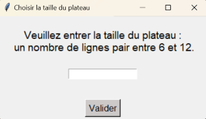
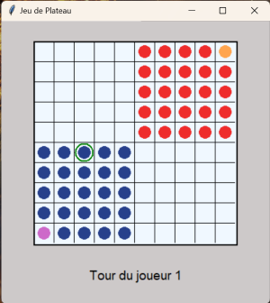
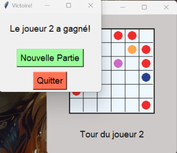

# Jeu de Plateau

## Description

Ce jeu de plateau se joue à deux. Il débute avec un plateau de jeu avec les pions des joueurs respectifs positionnés. En
La taille du plateau est choisie par les joueurs au démarrage du jeu, elle sera comprise entre 6 et 12 lignes paires.
Les pions du joueur 1 seront disposé en bas et en haut pour le joueur 2.
Le but du jeu est de capturer les pions adverse en respectant certaines régles de déplacement. 
Le joueur ne disposant plus que de deux pions perdra la partie. 

*Retrouvez l'ensemble de la notice du jeu [ici](/documents/Notice.md)*

---

## Instructrions d'installation

Ce jeu nécessite l'utilisation du langage Python et l'utilisation d'un IDE (VSCode, PyCharm...)
La bibliothèques et ressources utilisées : Tkinter pour la gestion des graphismes et des événements.

### Prérequis

- Assurez-vous d'avoir **Python 3.x** installé sur votre machine.
    - [Télécharger Python](https://www.python.org/downloads/)
- - **tkinter** est inclus avec Python par défaut. Assurez-vous que la bibliothèque est disponible :
  - Sur Windows : `tkinter` est inclus avec Python.
  - Sur macOS et Linux : `tkinter` peut nécessiter une installation supplémentaire (instructions ci-dessous).

### Instructions pour chaque système d'exploitation

#### **Windows**

1. **Installez Python :**
   - Téléchargez et installez Python depuis [python.org](https://www.python.org/downloads/).
   - Pendant l'installation, cochez l'option **"Add Python to PATH"**.

2. **Vérifiez que `tkinter` est disponible :**
   - Ouvrez un terminal (cmd ou PowerShell).
   - Tapez :
     ```bash
     python -m tkinter
     ```
   - Une fenêtre graphique devrait s'ouvrir. Si ce n'est pas le cas, réinstallez Python.

3. **Lancez le jeu :**
   - Allez dans le dossier `game` :
     ```bash
     cd game
     python main.py
     ```
---

#### **Linux**

1. **Installez Python :**
   - Python est souvent déjà installé. Vérifiez avec :
     ```bash
     python3 --version
     ```
   - Si ce n'est pas le cas, installez-le via votre gestionnaire de paquets :
     ```bash
     sudo apt-get update
     sudo apt-get install python3
     ```

2. **Installez `tkinter` :**
   - Si `tkinter` n'est pas inclus, installez-le avec :
     ```bash
     sudo apt-get install python3-tk
     ```

3. **Lancez le jeu :**
   - Exécutez dans le terminal :
     ```bash
     cd game
     python3 main.py
     ```
---

#### **macOS**

1. **Installez Python :**
   - Téléchargez et installez Python depuis [python.org](https://www.python.org/downloads/).
   - Ou utilisez Homebrew :
     ```bash
     brew install python
     ```

2. **Vérifiez `tkinter` :**
   - Ouvrez un terminal et tapez :
     ```bash
     python3 -m tkinter
     ```
   - Si `tkinter` n'est pas disponible, installez XQuartz :
     - Téléchargez-le depuis [xquartz.org](https://www.xquartz.org/).

3. **Lancez le jeu :**
   - Naviguez dans le dossier contenant `main.py` et tapez :
     ```bash
     cd game
     python3 main.py
     ```
---

## Exemple d'utilisation

- Initialisation du jeu: Choix de la taille du plateau de jeu: 



- Nouveau pateau de jeu: Début de la partie:



- Fin du jeu: Victoire et menu de sélection:



---

## Améliorations possibles : 

- Ajouter un tableau de prévisualisation des coups possibles.
- Améliorer les graphismes avec des animations et ajout de sons.
- Proposer un mode de jeu "challenge" avec un timer, le gagnant serait alors celui ayant le plus de pions restants à la fin du timer. 

---

## Auteurs:
Ce projet a été développé par :
- Luca Giuliani 
- Lucie Corominas

*Tous deux étudiants à SupInfo 1ère année bachelor of Engineering*

---

**Merci de votre intérêt pour notre jeu ! N'hésitez pas à nous soumettre vos suggestions.**
