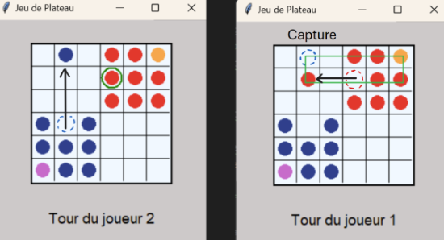

# Notice détaillée du jeu: 

## Plateau de jeu

- **Plateau carré** : Le jeu se déroule sur un tableau carré comportant `n x n` cases.
- **Taille du plateau de jeu** : La taille, `n`. sera laissée au choix des joueurs en début de partie.

## Les joueurs

- **Nombre joueurs** : Il y a deux joueurs qui s'affrontent, chacun ayant ses propres pièces.
  - Le joueur 1 recevra des tours bleues et une reine rose.
  - Le joueur 2 recevra des tours rouges et une reine orange.
- **Objectif du jeu** : Afin de gagner les joueur devront se déplacer de manière stratégie leur permettant de capturer les tours adverses, la reine ne peut être capturée. Le joueur qui ne posséde plus que deux pions, reine incluse, perd la partie. 

## Initialisation du jeu

Chaque joueur commence avec:
- **Une reine** d'une couleur distincte des tours.
- **Des tours**: Chaque joueur reçoit (($n^2$ // 4) - 1) tours. 
  - Si par exemple un plateau de 6 lignes est choisi, les joueurs recevront 9 Pions (1 reine et 8 tours)
- **Positionnement symétrique des joueurs** : Un joueur se positionne dans le coin haut droit, l'autre joueur se positionne dans le coin bas gauche du plateau. 
- **Groupement des pièces** : Les pièces sont placées de façon groupée dans leurs zones respective avec la reine dans le coin externe du plateau. L'ensemble forme un carré.

## Deux types de pièces

### La reine
- **Déplacements possibles sur plusieurs cases** : 
  - Orthogonalement (ligne droite) 
  - En diagonale.
- **Conditions** : Toutes les cases entre la position de départ et celle d’arrivée doivent être vides.
- **Remarque** : La reine n'effectue pas de capture lors des déplacement. La destination devra donc être une case vide.

### Les tours
- **Déplacements possibles sur plusieurs cases** : 
  - orthogonalement (ligne droite)
- **Conditions** : Toutes les cases entre la position de départ et celle d’arrivée doivent être vides.
- **Remarque** : 
  - Lors du déplacement une tour ne peut pas capturer une éventuelle pièce adverse se situant sur la case d'arrivée, celle ci devra donc être libre.

## Déroulement du jeu

Chaque joueur déplace une pièce selon les régles de déplacement de celle-ci. (cf ci-dessus)
- **Le déplacement d'une tour** peut alors déclencher des **captures sous certaines conditions**.

### Captures

Les captures peuvent se produire après le déplacement d'une tour mais pas après celui de la reine du joueur actif. 
Seules les tours adverses peuvent être capturées non la reine.

Lorsqu'un joueur (joueur actif) déplace une tour, il vérifie:
- **La position finale de cette tour**
    - Si la position finale **n'est pas alignée** (ligne/colonne) avec **sa propre reine** mais forme une **diagonale** d'un rectangle avec sa propre reine.
    - Les deux pièces du joueur (tour et reine) deviennent deux sommets d’une diagonale créant ensemble un rectangle.
- **Les sommets du rectangle**  
    - Si une ou deux tours adverses occupent ces sommets, elles peuvent être **capturées**.
- **Exemple en image** le joueur 2 (pièce rouge) capture ici une tour du joueur 1 (pièce bleue)

### Condition de défaite

Dès qu'un joueur n'a plus que **deux pièces ou moins** (reine incluse), il perd la partie.

