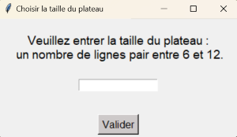
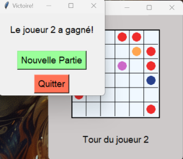

# Jeu de Plateau

## Description

Ce jeu de plateau se joue à deux. Il débute avec un plateau de jeu avec les pions des joueurs respectifs positionnés. En
La taille du plateau est choisie par les joueurs au démarrage du jeu, elle sera comprise entre 6 et 12 lignes paires.
Les pions du joueur 1 seront disposé en bas et en haut pour le joueur 2.
Le but du jeu est de capturer les pions adverse en respectant certaines régles de déplacement. 
Le joueur ne disposant plus que de deux pions perdra la partie. 

*Retrouvez l'ensemble de la notice du jeu [ici](Notice.md)*

---

## Instructrions d'installation

Ce jeu nécessite l'utilisation du langage Python et l'utilisation d'un IDE (VSCode, PyCharm...)
La bibliothèques et ressources utilisées : Tkinter pour la gestion des graphismes et des événements.

### Prérequis

- Assurez-vous d'avoir **Python 3.x** installé sur votre machine.
    - [Télécharger Python](https://www.python.org/downloads/)
- Assurez-vous d'avoir au choix **Visual Studio Code** ou **PyCharm** ou un autre IDE, installé sur votre machine.
    - [Télécharger VSCode](https://code.visualstudio.com/)
    - [Télécharger PyCharm Community Edition](https://www.jetbrains.com/pycharm/download/?section=windows)

## Lancement du jeu

1. Ouvrez le fichier `main.py`qui se trouve dans le dossier game [ici](../game/main.py)
2. Lancez le jeu grâce à l'option **Run** de l'IDE choisie et installée précedement.

---

## Exemple d'utilisation

- Initialisation du jeu: Choix de la taille du plateau de jeu: 

- Nouveau pateau de jeu: Début de la partie:

- Fin du jeu: Victoire et menu de sélection:

---

## Structure du dossier

Voici une brève présentation de la structure du dossier :

---

## Modélisation du programme (UML):

Pour une vision complète des classes et méthodes présentes dans le jeu vous trouverez un UML diagram [ici](UML.pdf)

## Améliorations possibles : 

- Ajouter un tableau de prévisualisation des coups possibles.
- Améliorer les graphismes avec des animations et ajout de sons.
- Proposer un mode de jeu "challenge" avec un timer, le gagnant serait alors celui ayant le plus de pions restants à la fin du timer. 

---

## Auteurs:
Ce projet a été développé par :
- Luca Giuliani 
- Lucie Corominas

*Tous deux étudiants à SupInfo 1ère année bachelor of Engineering*

---

**Merci de votre intérêt pour notre jeu ! N'hésitez pas à nous soumettre vos suggestions.**

